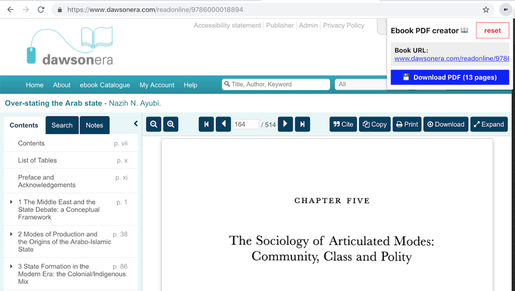
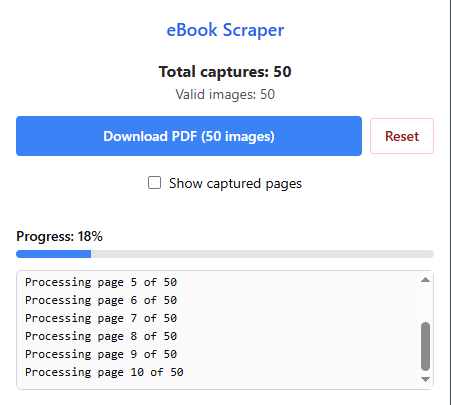

# eBook Scraper


A Chrome extension that compiles PDFs while reading ebooks from supported academic platforms.



## Features

- Compile PDFs while reading ebooks
- Support for multiple academic platforms
- Built atop this solid [Chrome extension foundation](https://github.com/martellaj/chrome-extension-react-typescript-boilerplate)

## Supported source sites

- ProQuest
- JStor
- Dawsonera

## Installation & Setup

### Prerequisites

- [Node.js](https://nodejs.org/)
- [Google Chrome](https://www.google.com/chrome/)

### Installation

1. **Clone the repository**
   ```bash
   git clone git@github.com:janbaykara/ebook-scraper.git
   cd ebook-scraper
   ```

2. **Install dependencies**
   ```bash
   npm install
   ```

3. **Build the extension**
   ```bash
   npm run build
   ```

### Loading the Extension in Chrome

1. **Open Chrome Extensions page**
   - Navigate to `chrome://extensions/` in your Chrome browser
   - Or go to Chrome menu → More tools → Extensions

2. **Enable Developer mode**
   - Toggle the "Developer mode" switch in the top right corner

3. **Load the extension**
   - Click "Load unpacked" button
   - **Important:** Navigate to and select the **`dist/` directory** (the build output folder), not the root or `src/` folder
   - The extension should now appear in your extensions list

4. **Verify installation**
   - You should see "eBook Scraper" in your extensions list
   - The extension icon should appear in your Chrome toolbar
   - Check that the extension shows as "Active"

### Usage



1. Navigate to a supported ebook platform (ProQuest, JStor, Dawsonera)
2. Open an ebook you want to scrape
3. Click through each page as they load to capture images
4. Click the eBook Scraper extension icon in your toolbar
5. Use the popup interface to save pages and compile your PDF

## Development

### Available Scripts

- `npm run dev` - Start development mode with hot-reload
- `npm run build` - Build the extension for production
- `npm run preview` - Serve the compiled production build locally from dist

### Troubleshooting

**Extension not loading:**
- Make sure you're selecting the `dist/` directory (build output), not the root or `src/` folder
- Ensure you've run `npm run build` or `npm run watch` first
- Check that `manifest.json` exists in the `dist/` directory after building

**Build errors:**
- Try deleting `node_modules/` and running `npm install` again
- Ensure you're using Node.js version 16 or higher

### Project Structure

```
ebook-scraper/
├── src/                        # Source code
│   ├── js/                     # TypeScript/JavaScript files
│   │   ├── common/             # Shared utilities
│   │   │   ├── sites.ts        # Site configurations for ProQuest, JStor, Dawsonera
│   │   │   └── utils.ts        # Helper functions
│   │   ├── eventPage/          # Background script
│   │   │   ├── actions.ts      # Extension actions (save, delete, etc.)
│   │   │   └── index.ts        # Background script entry point
│   │   ├── popup/              # Extension popup interface
│   │   │   ├── Components.tsx  # React components
│   │   │   ├── Popup.tsx       # Main popup component
│   │   │   ├── index.tsx       # Popup entry point
│   │   │   └── pdf.ts          # PDF generation logic
│   │   └── types/              # TypeScript definitions
│   │       └── declarations.d.ts
│   ├── manifest/
|       ├── plugin.ts           # Vite plugin for injesting manifest site permissions
|       └── template.json       # Extension manifest template
├── package.json                # Dependencies and scripts
├── tsconfig.json               # Base TypeScript configuration
├── tsconfig.app.json           # App TypeScript configuration
├── tsconfig.vite.json          # Vite bundler TypeScript configuration
└── vite.config.ts              # Vite configuration
```

## Contributing

This project welcomes contributions! Please see the [discussions page](https://github.com/janbaykara/ebook-scraper/discussions/12) if you'd like to help maintain this repository.
