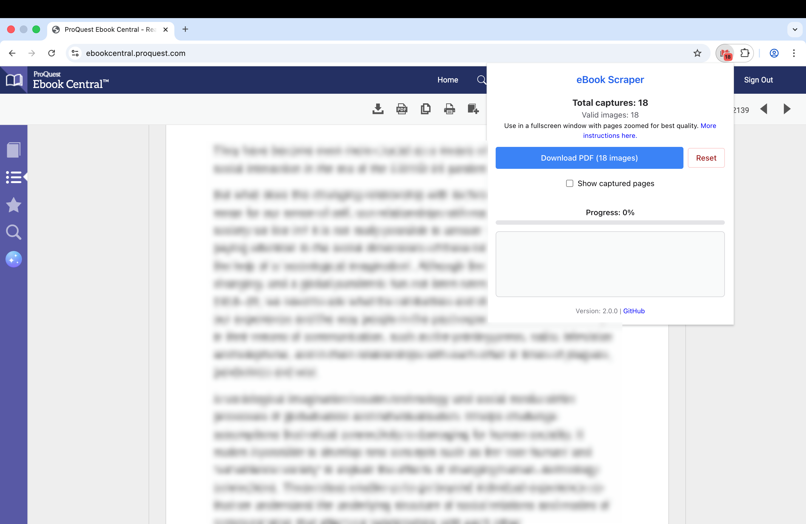
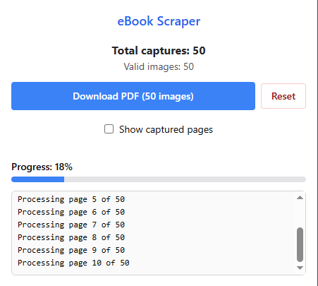

# eBook Scraper

A modern browser extension to help you create PDFs from ebooks hosted on supported academic platforms.

### Supported Platforms
- JStor
- Ebook Central by ProQuest

### Supported Browsers
- Chrome
- Firefox

*This extension likely works on most Chromium and Firefox based browsers, though it's only been tested on those above*

<a href="https://chromewebstore.google.com/detail/ebook-scraper/bhoifjhgahfmjkonopmmfifdfjacjeak">

</a>



## Usage

1. Navigate to a supported ebook platform (ProQuest, JStor).
2. Open an ebook you want to scrape.
3. Click through each page as they load to capture images.
4. Click the **eBook Scraper** extension icon in your toolbar.
5. Use the popup interface to save pages and compile your PDF.



Note: Attempting to save very large ebooks may max out your computer's RAM and cause the browser to crash. Consider saving large ebooks in seperate blocks and collate later.

## Developer Instructions

### Prerequisites
- **Node.js** (v18.0 or higher).

### Prepare the Local Environment

1. **Clone the repository and install dependencies**
   ```bash
   git clone https://github.com/janbaykara/ebook-scraper.git
   cd ebook-scraper
   npm install
   npx wxt-prepare
2. **Launch the extension automatically with hot-reloading**
   ```bash
   npx wxt                    #Chrome
   npx wxt -b firefox         #Firefox
3. **Build files for production**
   ```bash
   npx wxt build              #Chrome
   npx wxt build -b firefox   #Firefox